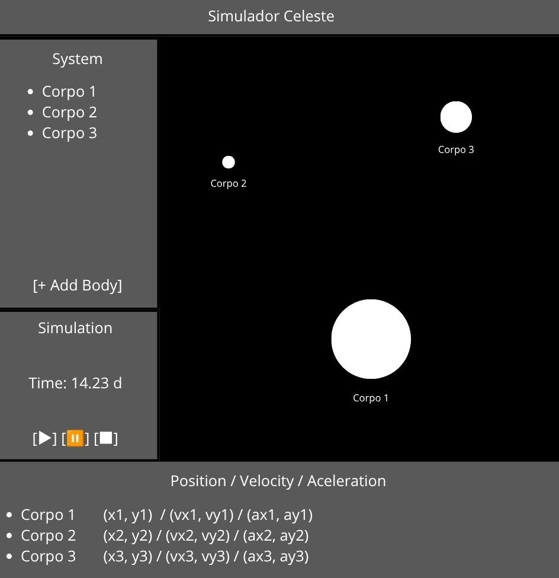

# Celestial Simulator

<div align="center">



*Celestial Simulator Interface Ideation*

----- The project runs on python 3.9.x -----

</div>

## Instalation

### 1. Clone the repository

```bash
git clone https://github.com/AbrSerafim/Celestial_Simulator
```

### 2. Setup
#### If using powershell first allow it to run scripts with; the script will automatically download python 3.9.13, create a venv and install all requirements into it (Requires Microsoft App Installer)

```bash
Set-ExecutionPolicy RemoteSigned -Scope CurrentUser
```
#### Then

```bash
.\setup.ps1
```
#### Else setup python mannually then run
```bash
pip install -r requirements.tx
```